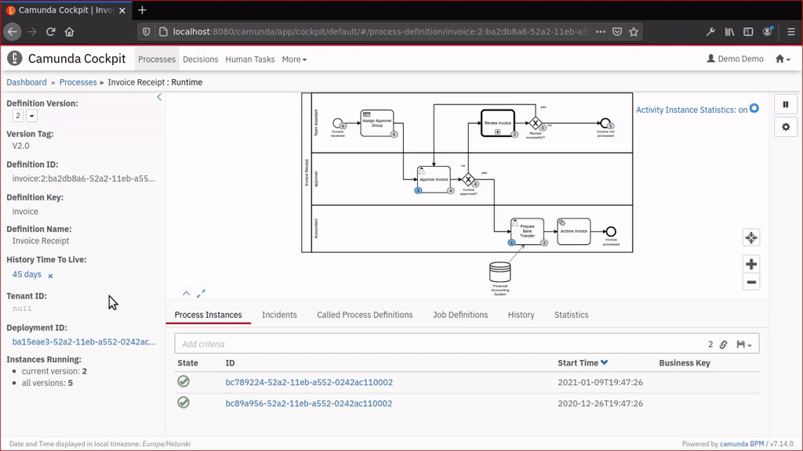

Minimal "history plugins" for Operaton and Camunda 7 Cockpit
============================================================

[](https://github.com/datakurre/operaton-cockpit-plugins/actions/workflows/ci.yml)
[](https://codecov.io/gh/datakurre/operaton-cockpit-plugins)

Note: Due to Camunda 7 EOL in October 2025, these plugins have been tested to be compatible with [Operaton 1.0.0-beta-1 and 2](https://operaton.org) and the repository has been renamed.



Breaking changes
----------------

* [2021-08-13](https://github.com/datakurre/operaton-cockpit-plugins/tree/66888bcb36f351880835b007b5e75dc44c732fb9): Change definition view plugins (historic activities and instances) to only show data for the current definition version

* [the last version before this changelog](https://github.com/datakurre/operaton-cockpit-plugins/tree/608f7f1d2c240c810dac466890decb91f4da5688)


The plugins
-----------

Each plugin is a standalone `*.js` bundle. Built bundles are committed to the repository, so you can
deploy them without running the build.

### Cockpit

| Bundle | Where it appears | What it does |
|--------|------------------|--------------|
| `dashboard-favourites.js` | Dashboard section + star button on a process definition | Star process definitions and list the starred ones on the dashboard with running instance and incident counts |
| `dashboard-integrations.js` | Dashboard section | Lists external tasks that have an incident or are currently locked, with retry and unlock actions (individual and batch) |
| `definition-historic-activities.js` | Definition tab *Statistics* + diagram | Historic activity statistics with a filter box, plus per-activity count badges on the diagram |
| `definition-tab-modify.js` | Definition tab *Modify* | Batch modification, message correlation and signal broadcast across instances of a definition. Every operation has a dry run that shows both the instances it would reach and the exact request it would send |
| `instance-auto-refresh.js` | Instance diagram | Toggle button for periodic auto-refresh of the instance view |
| `instance-action-unlock.js` | Instance action button | Dialog listing the instance's locked external tasks, with batch unlock |
| `instance-historic-activities.js` | Instance tab *Audit Log* + diagram | Audit log for the instance, activity overlays and executed sequence-flow highlighting. Flows taken more than once are drawn heavier, and hovering one names the exact traversal count |
| `instance-route-history.js` | Definition tab *History*, instance diagram toggle, and the route `#/history/process-instance/:id` | Filterable, paginated list of historic instances, and a full history view with BPMN viewer, audit log and variables |
| `instance-tab-modify.js` | Instance tab *Modify* | Modify a single running instance (start/cancel activities, transitions) and correlate a message to it |
| `cockpit-custom-styles.js` | — | Injects [src/cockpit-custom-styles.scss](src/cockpit-custom-styles.scss); no JavaScript behaviour. Also backfills Bootstrap 3 `col-xs-*` classes that Operaton omits |
| `robot-module.js` | `bpmnJs.additionalModules` | Draws a Robot Framework icon on service tasks whose id matches `/robot/i` |

### Admin

| Bundle | Where it appears | What it does |
|--------|------------------|--------------|
| `admin-route-authorization.js` | Admin route *Authorizations* | Two-panel authorization browser with create, edit and delete, filtering, and a "check resources" pass that flags authorizations pointing at resources that no longer exist |
| `admin-nologin.js` | — | Hides the signin form (see [No-login plugins](#no-login-plugins)) |

### Tasklist

| Bundle | Where it appears | What it does |
|--------|------------------|--------------|
| `tasklist-audit-log.js` | Task detail tab *Audit Log* | Audit log of the process instance the task belongs to |
| `tasklist-nologin.js` | — | Hides the signin form |

### No-login plugins

`cockpit-nologin.js`, `tasklist-nologin.js`, `admin-nologin.js` and `welcome-nologin.js` contain no
JavaScript behaviour at all — each only injects a stylesheet that hides `form[name="signinForm"]`.
They are for deployments where authentication happens outside the webapp (SSO, a reverse proxy,
pre-authentication) and the login form would only confuse users. They do **not** provide
authentication and they do **not** protect anything: the form is hidden with CSS, nothing more.

Only `admin-nologin.js` and `tasklist-nologin.js` are part of the default Docker image, because they
are listed in [admin-config.js](admin-config.js) and [tasklist-config.js](tasklist-config.js). To hide
the Cockpit or Welcome login form, deploy `cockpit-nologin.js` with
[cockpit-nologin-config.js](cockpit-nologin-config.js), or `welcome-nologin.js` with
[welcome-config.js](welcome-config.js), yourself.

### Not included

`decisions-dashboard.js` is **abandoned** and is deliberately not referenced by any configuration and
not bundled into the Docker image. It was an attempt to put DMN decision evaluation directly into
Cockpit; that turned out to be the wrong home for it. Use the
`datakurre.operaton-dmn-modeler` VS Code extension instead, which does the same job next to the DMN
file you are editing. The sources and the built bundle are kept only so the code stays buildable.


Try it
------

With Operaton (build image without needing any context directory):

```bash
# Build directly from GitHub without cloning:
curl -fsSL https://raw.githubusercontent.com/datakurre/operaton-cockpit-plugins/main/Dockerfile | docker build -t operaton-with-plugins -

# Or build from a local clone without build context:
docker build -t operaton-with-plugins - < Dockerfile

# Run the container:
docker run --rm -p 8080:8080 operaton-with-plugins
```

Access Cockpit at `http://localhost:8080/operaton/app/cockpit/` (credentials: `demo` / `demo`).

With Camunda Platform 7.14.0 and 7.20.0 or later:

```bash
$ git clone https://github.com/datakurre/operaton-cockpit-plugins.git
$ docker run --rm -p 8080:8080 -v $(pwd)/operaton-cockpit-plugins:/camunda/webapps/camunda/app/cockpit/scripts/:ro camunda/camunda-bpm-platform:7.14.0
```

With Camunda Platform 7.15.0 to 7.19.0:

```bash
$ git clone https://github.com/datakurre/operaton-cockpit-plugins.git
$ docker run -d --name mytemp camunda/camunda-bpm-platform:7.15.0
$ docker cp mytemp:/camunda/webapps/camunda/app/cockpit/scripts/camunda-cockpit-ui.js operaton-cockpit-plugins
$ docker rm -vf mytemp
$ docker run --rm -p 8080:8080 -v $(pwd)/operaton-cockpit-plugins:/camunda/webapps/camunda/app/cockpit/scripts/:ro camunda/camunda-bpm-platform:7.15.0
```

See also the example [Dockerfile for Camunda Run 7.15.0](https://github.com/datakurre/operaton-cockpit-plugins/issues/16#issuecomment-874499953).

If you don't immediately see the plugin, try again with your browser's private browsing mode. It is a common issue browser has cached a previous Cockpit plugin configuration without these plugins.

Note: Trying out the plugins with Camunda Platform 7.15.0 Docker image is more complex than with the previous version 7.14.0, because the new location of `camunda-cockpit-ui.js` prevents simple override of the scripts folder.


Use it
------

### Docker (Operaton)

A multi-stage [Dockerfile](Dockerfile) is provided to build a ready-to-run Operaton image with all plugins for Cockpit, Admin, and Tasklist bundled into the internal webapp archives.

Because all assets are fetched during the build stage, no local context directory is required.

**Build directly from GitHub:**
```bash
curl -fsSL https://raw.githubusercontent.com/datakurre/operaton-cockpit-plugins/main/Dockerfile | docker build -t operaton-with-plugins -
```
*(or `docker build -t operaton-with-plugins https://raw.githubusercontent.com/datakurre/operaton-cockpit-plugins/main/Dockerfile`)*

**Build from local file without context:**
```bash
docker build -t operaton-with-plugins - < Dockerfile
```

**Customizing build arguments:**
```bash
docker build \
  --build-arg OPERATON_IMAGE=operaton/operaton:latest \
  --build-arg PLUGINS_REF=main \
  -t operaton-with-plugins - < Dockerfile
```

**Run:**
```bash
docker run --rm -p 8080:8080 operaton-with-plugins
```

The image covers Cockpit, Admin and Tasklist. It does not include the Welcome app plugin or the
Cockpit no-login plugin; add those yourself if you need them.

### Spring Boot

Each webapp reads its own `config.js` from its own `scripts` directory, so the per-app configuration
files in this repository have to be **renamed to `config.js`** when you copy them. Copy each bundle
next to the config that references it:

```shell
src/main/resources/
└── META-INF
    └── resources
        └── webjars
            └── operaton
                └── app
                    ├── cockpit
                    │   └── scripts
                    │       ├── config.js                          # from config.js
                    │       ├── cockpit-custom-styles.js
                    │       ├── dashboard-favourites.js
                    │       ├── dashboard-integrations.js
                    │       ├── definition-historic-activities.js
                    │       ├── definition-tab-modify.js
                    │       ├── instance-action-unlock.js
                    │       ├── instance-auto-refresh.js
                    │       ├── instance-historic-activities.js
                    │       ├── instance-route-history.js
                    │       ├── instance-tab-modify.js
                    │       └── robot-module.js
                    ├── admin
                    │   └── scripts
                    │       ├── config.js                          # from admin-config.js
                    │       ├── admin-nologin.js
                    │       └── admin-route-authorization.js
                    └── tasklist
                        └── scripts
                            ├── config.js                          # from tasklist-config.js
                            ├── tasklist-audit-log.js
                            └── tasklist-nologin.js
```

After this you can start the project and the plugins should be loaded. Usually you customize
`config.js` per project and define there which plugins are included and where the browser should find
them. You may use a browser network inspector to check that Cockpit loads your version of `config.js`
and that the plugin JavaScript files get loaded too.

For use with Camunda 7, use directory `./src/main/resources/META-INF/resources/webjars/camunda/app/...` instead.


### Other Distributions

[Check the forum discussion on how to package plugins for various alternative Camunda distributions.](https://forum.camunda.org/t/minimal-cockpit-history-plugins-for-camunda-7-14-0/24651)


Configuration
-------------

### Plugin configuration

Every webapp loads the plugins listed in the `customScripts` array of its own `config.js`. This
repository ships one configuration file per webapp:

| File | Webapp | Loads |
|------|--------|-------|
| [config.js](config.js) | Cockpit | the ten Cockpit plugins plus `robot-module.js` as a `bpmnJs.additionalModules` entry |
| [admin-config.js](admin-config.js) | Admin | `admin-nologin.js`, `admin-route-authorization.js` |
| [tasklist-config.js](tasklist-config.js) | Tasklist | `tasklist-nologin.js`, `tasklist-audit-log.js` |
| [welcome-config.js](welcome-config.js) | Welcome | `welcome-nologin.js` |
| [cockpit-nologin-config.js](cockpit-nologin-config.js) | Cockpit | `cockpit-nologin.js` only — an alternative to `config.js` |

The Cockpit configuration is:

```javascript
export default {
  customScripts: [
    'scripts/dashboard-favourites.js',
    'scripts/dashboard-integrations.js',
    'scripts/definition-historic-activities.js',
    'scripts/definition-tab-modify.js',
    'scripts/instance-auto-refresh.js',
    'scripts/instance-action-unlock.js',
    'scripts/instance-historic-activities.js',
    'scripts/instance-route-history.js',
    'scripts/instance-tab-modify.js',
    'scripts/cockpit-custom-styles.js'
  ],
  bpmnJs: {
    additionalModules: [
      'scripts/robot-module.js'
    ],
  },
  disableWelcomeMessage: true,
  previewHtml: true
};
```

Drop any line to disable that plugin; the bundles are independent of each other.

### localStorage settings

Shared user preferences are stored under the key `minimal-history-plugin` as a single JSON object:

| Setting | Type | Default | Description |
|---------|------|---------|-------------|
| `autoRefresh` | boolean | `false` | Auto-refresh process instance views |
| `showHistoricBadges` | boolean | `false` | Show activity instance count badges on diagram |
| `showSequenceFlow` | boolean | `false` | Highlight the executed path on the diagram |
| `leftPaneSize` | number | `null` | Left pane width in history view (pixels) |
| `topPaneSize` | number | `null` | Top pane height in history view (pixels) |
| `maxResults` | number | `1000` | Maximum results for history API queries |

Some plugins keep their own state under separate keys:

| Key | Written by | Contents |
|-----|------------|----------|
| `minimal-history-plugin-favourites` | `dashboard-favourites` (read by `dashboard-integrations`) | Starred process definitions, as `[{ key, name }]` |
| `minimal-history-plugin-integrations-favourites-only` | `dashboard-integrations` | Whether the integrations list is limited to starred definitions (default `true`) |
| `minimal-history-plugin-saved-searches-definition-activities` | `definition-historic-activities` | Saved filter-box searches |
| `minimal-history-plugin-saved-searches-instance-history` | `instance-route-history` | Saved filter-box searches |
| `minimal-history-plugin-saved-searches-authorizations` | `admin-route-authorization` | Saved filter-box searches |

### URL query parameters

The shared settings above can also be set from the URL. The parameters are read from the part of the
**hash** after `?`. The three boolean parameters are enabled by their mere presence — any value,
including none, turns them on. They can only turn a setting *on*: a setting already stored as `true` in
localStorage stays on whether or not the parameter is in the URL.

| Parameter | Description |
|-----------|-------------|
| `autoRefresh` | Enable auto-refresh |
| `showHistoricBadges` | Show historic badges |
| `showSequenceFlow` | Show executed sequence flows |
| `maxResults=N` | Override max results (e.g. `maxResults=500`) |

Example URL with parameters:
```
http://localhost:8080/operaton/app/cockpit/default/#/process-instance/123?autoRefresh&showSequenceFlow
```


Known limitations
-----------------

These are current gaps, not bugs to report:

* **Signal broadcast is engine-wide.** The *Signal* tab posts to `/signal` without an execution ID, so
  it triggers every matching signal catch event in every deployed process definition, not only in the
  definition you are looking at. The engine offers no way to query that set, so the dry run lists
  instances of the current definition only and says so; the real reach is wider than the list.

* **History queries are capped.** History endpoints return at most `maxResults` records (1000 by
  default). Raise it with the `maxResults` setting or URL parameter if you need more.

* **The executed path is inferred, not reported.** The engine records which activities ran, never which
  sequence flows were taken, so the green path is reconstructed from activity timestamps. Exclusive
  gateways are resolved to the branch taken on each pass. Inclusive and event-based gateways use the
  plain rule, which handles them: an inclusive gateway draws every branch that fired and not the ones
  that did not, and for an event-based gateway the engine records nothing at all for the branches that
  lost, so only the winner is drawn.

* **A long instance is drawn from a partial history.** The activity history behind the diagram is
  bounded by `maxResults`, oldest first, so an instance with more activity records than that is drawn
  from a chronological prefix: the path is complete up to a point and then stops, and each traversal
  count is a lower bound. The plugin says so rather than letting that read as the whole story — the
  sequence flow toggle turns amber and its tooltip warns, and each path reads "Executed at least N
  times". Raise `maxResults` to take in more.


Requirements
------------

* Operaton or Camunda 7 Cockpit, which passes `api.engineApi` and related fields to each plugin
* The REST API reachable from the browser, including the `/history/*` endpoints used by the history
  and audit log views
* Authorizations for whatever a plugin touches. Plugins do not add permissions of their own: a user
  who cannot modify instances through the REST API cannot modify them through the *Modify* tab either


Develop it
----------

```bash
$ cd operaton-cockpit-plugins
$ npm install
$ npm run watch
```

`npm run watch` rebuilds the bundles with sourcemaps on every change. When the scripts are mounted into
a running Docker container, changes are visible after a page refresh.

For a complete local stack, [devenv.nix](devenv.nix) runs Operaton with PostgreSQL behind a Caddy
proxy on port 8000 that serves the configuration files and bundles straight from the repository root:

```bash
$ make up      # devenv up
$ npm run watch
```

### Commands

| Command | Description |
|---------|-------------|
| `npm run build` | Production bundles (no sourcemaps) |
| `BUILD_PLUGIN=<name> npm run build` | Build only bundles whose name contains `<name>` |
| `npm run watch` | Development build with file watching |
| `npm test` | Run the Jest test suite |
| `npm run test:coverage` | Run tests with a coverage report |
| `npm run typecheck` | TypeScript type checking |
| `npm run lint` / `npm run lint:fix` | ESLint |
| `npm run prettier:check` / `npm run prettier:format` | Prettier |
| `npm run check` | typecheck + lint + prettier, all of them |
| `npm run fix` | lint --fix + prettier --write |

Sources live in `src/`; the top-level `*.js` files are generated. Edit the sources and rebuild — never
edit a bundle by hand. See [AGENTS.md](AGENTS.md) for a map of the codebase and its conventions.
